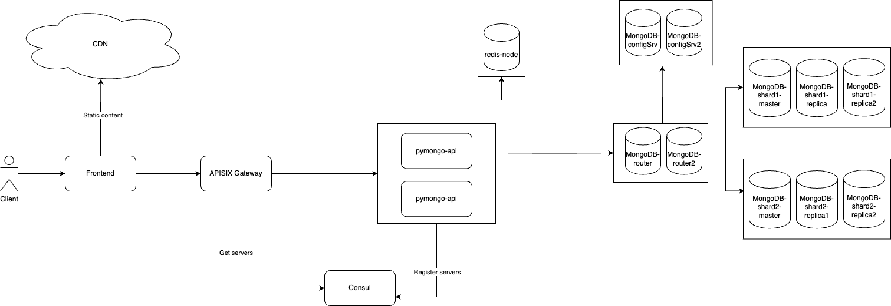

# mongo-scaling

## Обзор

Поэтапное масштабирование приложения 

Каждый этап в отдельной директории

Инструкции по запуску и тестированию каждого этапа отображена в README.md в корне его директории

Финальная архитектура отображена на схеме:

### mongo-sharding

Добавлено шардирование в mongo

### mongo-sharding-rpl

У каждого шарда появилось по 2 реплики

### sharding-repl-cache

Добавлен инстанс redis

