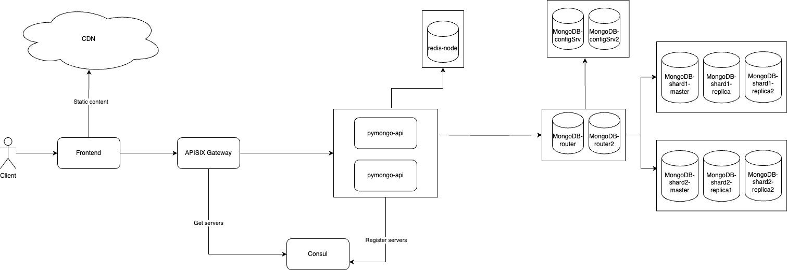

# MongoDB Scaling & High Availability PoC

## Overview

This repository is an Infrastructure Proof-of-Concept (PoC) demonstrating the evolutionary scaling of a MongoDB-backed system. It illustrates the transition from a basic sharded setup to a highly available, distributed cluster with a caching layer.

The project is designed to test and observe cluster behavior, data distribution, and fault tolerance under simulated loads. The bundled API acts as a mock client to generate traffic and validate topology state.

## Target Architecture

The final state of the infrastructure aims to support high-throughput operations with reduced read latency, integrating seamlessly into a larger microservices ecosystem behind an APISIX Gateway and Consul service mesh.



## Evolutionary Stages

To demonstrate the progression of infrastructure complexity, the repository is structured into three isolated stages. Each directory contains an independent `docker-compose` environment.

1. **`mongo-sharding/`** * **Focus:** Horizontal scaling.
   * **Details:** Introduces MongoDB sharding (2 shards) and a Mongos router to distribute the data payload based on a hashed shard key (`helloDoc`).

2. **`mongo-sharding-repl/`** * **Focus:** High Availability (HA) & Fault Tolerance.
   * **Details:** Upgrades the basic shards into Replica Sets (1 Primary, 2 Secondaries per shard). This ensures no single point of failure within the data nodes.

3. **`sharding-repl-cache/`** * **Focus:** Read Latency Optimization.
   * **Details:** Integrates a Redis instance to act as a caching layer for the API, significantly reducing the load on the MongoDB cluster for frequent read queries.

## Getting Started

Each stage is completely containerized. To run a specific stage, navigate to its directory and start the Docker Compose stack.

```bash
# 1. Navigate to the desired architectural stage
cd sharding-repl-cache

# 2. Start the infrastructure
docker compose up -d

# 3. Initialize the replica sets, shards, and seed test data
./scripts/mongo-init.sh
```

### Verification

Once initialized, the bash script will output the document counts across different shards and replicas, proving data distribution.

The mock API is exposed on port `8080`. You can interact with the cluster state and test the endpoints via Swagger UI:

* **Local:** `http://localhost:8080/docs`
* **Remote VM:** `http://<YOUR_VM_IP>:8080/docs`

## Technical Highlights

* **Declarative Infrastructure:** Entire MongoDB topology (Config Servers, Routers, Replica Sets) is defined and orchestrated via Docker Compose.
* **Automated Provisioning:** Custom bash scripts automate the MongoDB replica set initialization (`rs.initiate()`) and sharding configuration (`sh.addShard()`, `sh.shardCollection()`).
* **Topology Awareness:** The mock API dynamically resolves the MongoDB topology (Sharded, Replicaset) and reports the status of primary/secondary nodes and connection read preferences.
